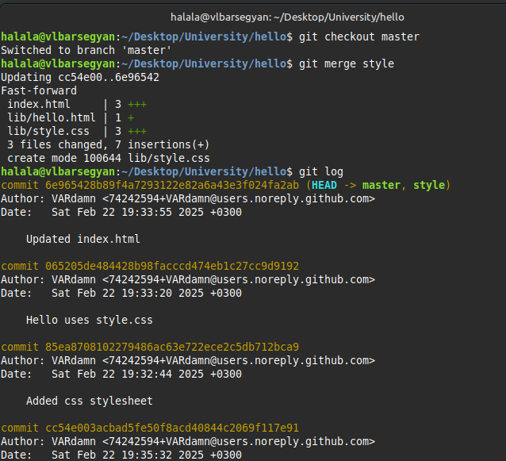

---
## Front matter
lang: ru-RU
title: Математическое моделирование. Лабораторная Работа №1
subtitle: Работа с git
author:
  - Барсегян В.Л.
institute:
  - Российский университет дружбы народов им. Патриса Лумумбы, Москва, Россия
date: 22 февраля 2025

## i18n babel
babel-lang: russian
babel-otherlangs: english

## Formatting pdf
toc: false
toc-title: Содержание
slide_level: 2
aspectratio: 169
section-titles: true
theme: metropolis
header-includes:
 - \metroset{progressbar=frametitle,sectionpage=progressbar,numbering=fraction}
---

# Информация

## Докладчик

  * Барсегян Вардан Левонович
  * НПИбд-01-22
  * Российский университет дружбы народов
  * [1132222005@pfur.ru]
  * <https://github.com/VARdamn/study_2024-2025_mathmod>

# Вводная часть

## Цели и задачи

- Знакомство с системой контроля версий git

# Выполнение лабораторной работы

## Подготовка

1. Настроим параметры установки окончаний строк и отображения unicode для устройства Linux. После, в папке *hello* создадим файл *hello.html* с содержимым, и инициализируем пустой git-репозиторий

{#fig:001 width=45%}

## Создание проекта и внесение изменений

2. Добавим файл в репозиторий.\
Проверим текущее состояние репозитория командой *git status*

{#fig:002 width=45%}

## Индексация изменений

3. Текущее содержимое файла *hello.html*

{#fig:003 width=45%}

## Индексация изменений

4. Индексирую изменения командой *git add hello.html* и проверяю. Теперь изменения проиндексированы.\
Коммичу изменения командой *git commit* и снова проверяю 

{#fig:004 width=45%}

## Индексация изменений

5. Обновляю содержимое *hello.html* 

{#fig:005 width=45%}

## Индексация изменений

6. Добавляю это изменение в индекс командой *git add hello.html*. Снова обновляю *hello.html* 

{#fig:006 width=45%}

## Индексация изменений

7. Проверяю текущие изменения. Добавляю последние изменения и коммичу. Снова проверяю статус 

{#fig:007 width=45%}

## Индексация изменений

8. Добавляю второе изменение в индекс и проверяю 

{#fig:008 width=45%}

## История

9. Получим список изменений командой *git log*\
Для однострочного формата введем *git log --pretty=oneline* 

{#fig:009 width=45%}

## История

10. Выведем справочную информацию командой *man git-log* 

{#fig:010 width=45%}

## История

11. Ввожу команду *git checkout <hash>*, где хэш - хэш первого коммита. Также просматриваю содержимое файла - оно равняется содержимому первого коммита 

{#fig:011 width=45%}

## История

12. Перехожу к последней версии ветки командой *git checkout master* и просматриваю содержимое файла - теперь оно актуальное. Создаю тег первой версии командой *git tag v1*. Перехожу к версии, предшествующей v1, командой *git checkout v1^*. 

{#fig:012 width=45%}

## История

13. Создаю для предшествующей версии тэг *v1-beta*. Перехожу к версии v1 и просматриваю все доступные тэги. Также просматриваю тэги в логе командой *git log master --all* 

{#fig:013 width=45%}

## Отмена локальных изменений (до индексации)

14. Обновляю содержимое hello.html 

{#fig:014 width=45%}

## Отмена локальных изменений (до индексации)

15. Проверяю состояние рабочего каталога (hello.html был изменен, но еще не проиндексирован). \
Командой *git checkout* переключаю версии файла hello.html в репозитории\
Команда *git status* показывает нам, что не было произведено никаких изменений, не зафиксированных в рабочем каталоге. 

{#fig:015 width=45%}

## Отмена проиндексированных изменений (перед коммитом)

16. Изменяю содержимое hello.html 

{#fig:016 width=45%}

## Отмена проиндексированных изменений (перед коммитом)

17. Индексирую изменения командой *git add hello.html*. Проверяю состояние изменения, после чего сбрасываю буферную зону командой *git reset HEAD hello.html*. Переключаюсь на версию коммита командой *git checkout hello.html* и снова проверяю статус. Проверяю содержимой файла - изменений теперь нет. 

{#fig:017 width=45%}

## Отмена коммитов

18. Изменяю содержимое hello.html 

{#fig:018 width=45%}

## Отмена коммитов

19. Индексирую изменения и коммичу их командой *git commit -m "Oops, we didn't want this commit"*. Отменяю коммит командой *git revert HEAD* - в результате получаю такой коммит 

{#fig:019 width=45%}

## Отмена коммитов

20. Проверяю логи 

{#fig:020 width=45%}

## Удаление коммитов из ветки

21. Отмечаю последний коммит тэгом командой *git tag oops*. Сбрасываю ветку до точки v1 командой *git reset --hard v1*. Проверяю логи - информация о двух последних коммитах пропала 

{#fig:021 width=45%}

## Удаление коммитов из ветки

22. Просматриваю все коммиты командой *git log --all* - здесь есть и последние два коммита 

{#fig:022 width=45%}

## Удаление тега oops

23. Удаляю тэг oops командой *git tag -d oops* и проверяю 

{#fig:023 width=45%}

## Внесение изменений в коммиты

24. Изменяю содержимое hello.html 

{#fig:024 width=45%}

## Внесение изменений в коммиты

25. Индексирую изменения и коммичу их. После, снова редактирую файл, добавляя почту, и коммичу изменения командой *git commit --amend -m "Add an author/email comment"*, т.е. изменяя последний коммит. Проверяю логи и вижу один новый коммит 

{#fig:025 width=45%}

## Перемещение файлов

26. Создаю папку lib и переношу страницу в каталог lib командой *git mv*. Проверяю изменения командой *git status*. Коммичу изменения 

{#fig:026 width=45%}

## Подробнее о структуре

27. Создаю в корне файл *index.html* и заполняю его. Коммичу изменения

{#fig:027 width=45%}

## Git внутри: Каталог .git

28. Просматриваю каталог со всей информацией о git командой *ls -C .git*. Выполняю команду *ls -C .git/objects*. Также просматриваю один из каталогов с именем из 2 букв. Просматриваю файл конфигурации командой *cat .git/config*

{#fig:028 width=45%}

## Работа непосредственно с объектами git

29. Выполняю команду *cat .git/HEAD* - содержится ссылка на ветку master. Просматриваю последний коммит командой *git log --max-count=1*. Также вывожу последний коммит с помощью хэша командой *git cat-file* 

{#fig:029 width=45%}

## Работа непосредственно с объектами git

30. Произвожу поиск дерева командой *git cat-file*, указав хеш дерева. Аналогично вывожу каталог lib и файл hello.html 

{#fig:030 width=45%}

## Работа непосредственно с объектами git

31. Исследую репозиторий самостоятельно: перехожу к последующему коммиту по хэшу родителя 

{#fig:031 width=45%}

##  Создание ветки

32. Создаю ветку командой *git checkout -b style* и проверяю ее статус. Создаю файл  style.css в папке lib, заполняю его, индексирую и коммичу. Обновляю файл lib/hello.html, добавляя в него ссылку на css-файл, и также индексирую и коммичу изменения. Обновляю файл index.html, индексирую и коммичу изменения 

{#fig:032 width=40%}

## Навигация по веткам

33. Проверяю логи последних коммитов, вижу все созданные коммиты, они в ветке style 

{#fig:033 width=45%}

## Навигация по веткам

34. Перехожу в ветку master и просматриваю содержимое файла lib/hello.html - в нем нет последних изменений. Просматриваю тот же файл в ветке style - изменения есть 

{#fig:34 width=45%}

## Изменения в ветке master

35. Перехожу в ветку master и создаю файл README.md командой *echo "This is the Hello World example from the git tutorial." > README.md*. Коммичу изменения и просматриваю логи, включая различия между ветками. 

{#fig:035 width=45%}

## Слияние

36. Перехожу в ветку style командой *git checkout style*. Сливаю master c style командой *git merge master*. Вывожу логи с деревом всех веток 

{#fig:036 width=45%}

## Создание конфликта

37. Возвращаюсь в ветку master и редактирую файл lib/hello.html. Коммичу изменения, просматриваю логи 

{#fig:037 width=45%}

## Разрешение конфликтов

38. Перехожу в ветку style и пытаюсь слить master с style. В файле lib/hello.html возникли конфликты. Разрешаю конфликты и коммичу изменения 

{#fig:038 width=45%}

## Сброс ветки style

39. Перехожу в ветку style и просматриваю логи изменений 

{#fig:039 width=45%}

## Сброс ветки style

40. Сбрасываю ветку к коммиту «Updated index.html» командой *git reset --hard <hash>* c использованием хэша коммита. Снова првоеряю лог ветки style 

{#fig:040 width=45%}

## Сброс ветки master

41. Перехожу в ветку master и аналогичным образом сбрасываю ее к коммиту «Added README». Просматриваю лог ветки master 

{#fig:041 width=45%}

## Перебазирование

42. Перехожу в ветку style и использую вместо слияния команду *git rebase master*. Просматриваю лог ветки. 

{#fig:042 width=45%}

## Слияние в ветку master

43. Перехожу в ветку master и сливаю style c master. Просматриваю лог - теперь ветки style и master идентичны. 

{#fig:043 width=40%}

## Клонирование репозиториев и просмотр клонированного репозитория

44. Перехожу в родительский каталог. Создаю клон репозитория hello в папке cloned_hello командой *git clone hello cloned_hello*. Перехожу в cloned_hello и просматриваю папки и файлы. Вывожу список всех коммитов командой *git log --all* 

{#fig:044 width=45%}

## Что такое origin? Удаленные ветки

45. Выполняю команды *git remote* и *git remote show origin* для более подробнной информации. Просматриваю ветки, доступные в клонированном репозитории, командой *git branch*. Просматриваю все ветки командой *git branch -а* 

{#fig:045 width=45%}

## Изменение оригинального репозитория

46. Редактирую README.md в репозитории hello и коммичу изменения. В клонированном репозитории выполняю *git fetch* для извлечения изменений, проверяю лог - вижу последний сделанный коммит 

{#fig:046 width=45%}

## Слияние извлеченных изменений

47. Проверяю клонированный файл README.md - он не изменился. Выполняю слияние извлеченных изменений командой *git merge origin/master*. Снова проверяю содержимое файла - теперь оно обновилось. 

{#fig:047 width=45%}

## Добавление ветки наблюдения

48. Выполняю: \
*git branch --track style origin/style* \
*git branch -a* \
*git log --max-count=2* \
Теперь можно видеть ветку style в списке веток и логе 

{#fig:048 width=45%}

## Создание чистого репозитория, добавление удаленного репозитория

49. Создаю чистый репозиторий командой *git clone --bare hello hello.git* и перехожу в него. Добавляю удаленный репозиторий командой *git remote add shared ../hello.git*. Редактирую файл README.md и отправляю изменения в общий репозиторий. В клонированном репозитории добавляю командой *git remote add shared ../hello.git*, и извлекаю сделанные изменения командой *git pull shared master*, проверяю файл 

{#fig:049 width=45%}

# Выводы

Я настроил git, научился с ним работать, узнал про различные ветки, слияние, перебазирование, чистые репозитории.
