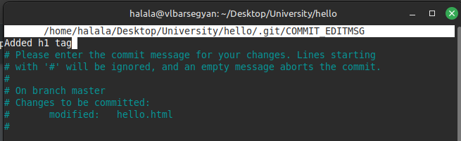

---
## Front matter
title: "Математическое моделирование. Лабораторная Работа №1"
subtitle: "Работа с git"
author: "Барсегян Вардан Левонович"

## Generic otions
lang: ru-RU
toc-title: "Содержание"

## Bibliography
bibliography: bib/cite.bib
csl: pandoc/csl/gost-r-7-0-5-2008-numeric.csl

## Pdf output format
toc: true # Table of contents
toc-depth: 2
lof: true # List of figures
lot: true # List of tables
fontsize: 12pt
linestretch: 1.5
papersize: a4
documentclass: scrreprt
## I18n polyglossia
polyglossia-lang:
  name: russian
  options:
    - spelling=modern
    - babelshorthands=true
polyglossia-otherlangs:
  name: english
## I18n babel
babel-lang: russian
babel-otherlangs: english
## Fonts
mainfont: IBM Plex Serif
romanfont: IBM Plex Serif
sansfont: IBM Plex Sans
monofont: IBM Plex Mono
mathfont: STIX Two Math
mainfontoptions: Ligatures=Common,Ligatures=TeX,Scale=0.94
romanfontoptions: Ligatures=Common,Ligatures=TeX,Scale=0.94
sansfontoptions: Ligatures=Common,Ligatures=TeX,Scale=MatchLowercase,Scale=0.94
monofontoptions: Scale=MatchLowercase,Scale=0.94,FakeStretch=0.9
mathfontoptions:
## Biblatex
biblatex: true
biblio-style: "gost-numeric"
biblatexoptions:
  - parentracker=true
  - backend=biber
  - hyperref=auto
  - language=auto
  - autolang=other*
  - citestyle=gost-numeric
## Pandoc-crossref LaTeX customization
figureTitle: "Рис."
tableTitle: "Таблица"
listingTitle: "Листинг"
lofTitle: "Список иллюстраций"
lotTitle: "Список таблиц"
lolTitle: "Листинги"
## Misc options
indent: true
header-includes:
  - \usepackage{indentfirst}
  - \usepackage{float} # keep figures where there are in the text
  - \floatplacement{figure}{H} # keep figures where there are in the text
---

# Цель работы

Знакомство с системой контроля версий git

# Задание

# Теоретическое введение

Git (произносится «гит») — распределённая система управления версиями. Проект был создан Линусом Торвальдсом для управления разработкой ядра Linux, первая версия выпущена 7 апреля 2005 года; координатор — Дзюн Хамано.

Среди проектов, использующих Git, — ядро Linux, Swift, Android, Drupal, Cairo, GNU Core Utilities, Mesa, Wine, Chromium, Compiz Fusion, FlightGear, jQuery, PHP, NASM, MediaWiki, DokuWiki, Qt, ряд дистрибутивов Linux.

Программа является свободной и выпущена под лицензией GNU GPL версии 2. По умолчанию используется TCP-порт 9418.

Разработка ядра Linux велась на проприетарной системе BitKeeper, которую автор — Ларри Маквой, сам разработчик Linux — предоставил проекту по бесплатной лицензии. Разработчики, высококлассные программисты, написали несколько утилит, и для одной Эндрю Триджелл произвёл реверс-инжиниринг формата передачи данных BitKeeper. В ответ Маквой обвинил разработчиков в нарушении соглашения и отозвал лицензию, и Торвальдс взялся за новую систему: ни одна из открытых систем не позволяла тысячам программистов кооперировать свои усилия (тот же конфликт привёл к написанию Mercurial). Идеология была проста: взять подход CVS и перевернуть с ног на голову, и заодно добавить надёжности.

Начальная разработка велась меньше чем неделю: 3 апреля 2005 года разработка началась, и уже 7 апреля код Git управлялся неготовой системой. 16 июня Linux был переведён на Git, а 25 июля Торвальдс отказался от обязанностей ведущего разработчика.[@wiki].

# Выполнение лабораторной работы

## Подготовка

1. Настроим параметры установки окончаний строк и отображения unicode для устройства Linux. После, в папке *hello* создадим файл *hello.html* с содержимым, и инициализируем пустой git-репозиторий (рис. [-@fig:001]).

{#fig:001 width=70%}

## Создание проекта и внесение изменений

2. Добавим файл в репозиторий.\
*git add hello.html*\
*git commit -m "Initial Commit"*\
Проверим текущее состояние репозитория командой *git status* (рис. [-@fig:002]).

{#fig:002 width=70%}

## Индексация изменений

3. Текущее содержимое файла *hello.html* (рис. [-@fig:003]).

{#fig:003 width=70%}

4. Индексирую изменения командой *git add hello.html* и проверяю. Теперь изменения проиндексированы.\
Коммичу изменения командой *git commit* и снова проверяю (рис. [-@fig:004]).

{#fig:004 width=70%}

5. Обновляю содержимое *hello.html* (рис. [-@fig:005]).

{#fig:005 width=70%}

6. Добавляю это изменение в индекс командой *git add hello.html*. Снова обновляю *hello.html* (рис. [-@fig:006]).

{#fig:006 width=70%}

7. Проверяю текущие изменения. Добавляю последние изменения и коммичу. Снова проверяю статус (рис. [-@fig:007]).

{#fig:007 width=70%}

8. Добавляю второе изменение в индекс и проверяю (рис. [-@fig:008]).

{#fig:008 width=70%}

## История

9. Получим список изменений командой *git log*\
Для однострочного формата введем *git log --pretty=oneline* (рис. [-@fig:009]).

{#fig:009 width=70%}

10. Выведем справочную информацию командой *man git-log* (рис. [-@fig:010]).

{#fig:010 width=70%}

11. Ввожу команду *git checkout <hash>*, где хэш - хэш первого коммита. Также просматриваю содержимое файла - оно равняется содержимому первого коммита (рис. [-@fig:011]).

{#fig:011 width=70%}

12. Перехожу к последней версии ветки командой *git checkout master* и просматриваю содержимое файла - теперь оно актуальное. Создаю тег первой версии командой *git tag v1*. Перехожу к версии, предшествующей v1, командой *git checkout v1^*. (рис. [-@fig:012]).

{#fig:012 width=70%}

13. Создаю для предшествующей версии тэг *v1-beta*. Перехожу к версии v1 и просматриваю все доступные тэги. Также просматриваю тэги в логе командой *git log master --all* (рис. [-@fig:013]).

{#fig:013 width=70%}

## Отмена локальных изменений (до индексации)

14. Обновляю содержимое hello.html (рис. [-@fig:014]).

{#fig:014 width=70%}

15. Проверяю состояние рабочего каталога (hello.html был изменен, но еще не проиндексирован). \
Командой *git checkout* переключаю версии файла hello.html в репозитории\
*git checkout hello.html*\
*git status*\
*cat hello.html*\
Команда *git status* показывает нам, что не было произведено никаких изменений, не зафиксированных в рабочем каталоге. (рис. [-@fig:015]).

{#fig:015 width=70%}

## Отмена проиндексированных изменений (перед коммитом)

16. Изменяю содержимое hello.html (рис. [-@fig:016]).

{#fig:016 width=70%}

17. Индексирую изменения командой *git add hello.html*. Проверяю состояние изменения, после чего сбрасываю буферную зону командой *git reset HEAD hello.html*. Переключаюсь на версию коммита командой *git checkout hello.html* и снова проверяю статус. Проверяю содержимой файла - изменений теперь нет. (рис. [-@fig:017]).

{#fig:017 width=70%}

## Отмена коммитов

18. Изменяю содержимое hello.html (рис. [-@fig:018]).

{#fig:018 width=70%}

19. Индексирую изменения и коммичу их командой *git commit -m "Oops, we didn't want this commit"*. Отменяю коммит командой *git revert HEAD* - в результате получаю такой коммит (рис. [-@fig:019]).

{#fig:019 width=70%}

20. Проверяю логи (рис. [-@fig:020]).

{#fig:020 width=70%}

## Удаление коммитов из ветки

21. Отмечаю последний коммит тэгом командой *git tag oops*. Сбрасываю ветку до точки v1 командой *git reset --hard v1*. Проверяю логи - информация о двух последних коммитах пропала (рис. [-@fig:021]).

{#fig:021 width=70%}

22. Просматриваю все коммиты командой *git log --all* - здесь есть и последние два коммита (рис. [-@fig:022]).

{#fig:022 width=70%}

## Удаление тега oops

23. Удаляю тэг oops командой *git tag -d oops* и проверяю (рис. [-@fig:023]).

{#fig:023 width=70%}

## Внесение изменений в коммиты

24. Изменяю содержимое hello.html (рис. [-@fig:024]).

{#fig:024 width=70%}

25. Индексирую изменения и коммичу их. После, снова редактирую файл, добавляя почту, и коммичу изменения командой *git commit --amend -m "Add an author/email comment"*, т.е. изменяя последний коммит. Проверяю логи и вижу один новый коммит (рис. [-@fig:025]).

{#fig:025 width=70%}

## Перемещение файлов

26. Создаю папку lib и переношу страницу в каталог lib командой *git mv*. Проверяю изменения командой *git status*. Коммичу изменения (рис. [-@fig:026]).

{#fig:026 width=70%}

## Подробнее о структуре

27. Создаю в корне файл *index.html* и заполняю его (рис. [-@fig:027]). Коммичу изменения

{#fig:027 width=70%}

## Git внутри: Каталог .git

28. Просматриваю каталог со всей информацией о git командой *ls -C .git*. Выполняю команду *ls -C .git/objects*. Также просматриваю один из каталогов с именем из 2 букв. Просматриваю файл конфигурации командой *cat .git/config*. Далее выполняю \
*ls .git/refs* \
*ls .git/refs/heads* \
*ls .git/refs/tags* \
*cat .git/refs/tags/v1* (рис. [-@fig:028]).

{#fig:028 width=70%}

## Работа непосредственно с объектами git

29. Выполняю команду *cat .git/HEAD* - содержится ссылка на ветку master. Просматриваю последний коммит командой *git log --max-count=1*. Также вывожу последний коммит с помощью хэша командой *git cat-file* (рис. [-@fig:029]).

{#fig:029 width=70%}

30. Произвожу поиск дерева командой *git cat-file*, указав хеш дерева. Аналогично вывожу каталог lib и файл hello.html (рис. [-@fig:030]).

{#fig:030 width=70%}

31. Исследую репозиторий самостоятельно: перехожу к последующему коммиту по хэшу родителя (рис. [-@fig:031]).

{#fig:031 width=70%}

##  Создание ветки

32. Создаю ветку командой *git checkout -b style* и проверяю ее статус. Создаю файл  style.css в папке lib, заполняю его, индексирую и коммичу. Обновляю файл lib/hello.html, добавляя в него ссылку на css-файл, и также индексирую и коммичу изменения. Обновляю файл index.html, индексирую и коммичу изменения (рис. [-@fig:032]).

{#fig:032 width=70%}

## Навигация по веткам

33. Проверяю логи последних коммитов, вижу все созданные коммиты, они в ветке style (рис. [-@fig:033]).

{#fig:033 width=70%}

34. Перехожу в ветку master и просматриваю содержимое файла lib/hello.html - в нем нет последних изменений. Просматриваю тот же файл в ветке style - изменения есть (рис. [-@fig:034]).

{#fig:034 width=70%}

## Изменения в ветке master

35. Перехожу в ветку master и создаю файл README.md командой *echo "This is the Hello World example from the git tutorial." > README.md*. Коммичу изменения и просматриваю логи, включая различия между ветками. (рис. [-@fig:035]).

{#fig:035 width=70%}

## Слияние

36. Перехожу в ветку style командой *git checkout style*. Сливаю master c style командой *git merge master*. Вывожу логи с деревом всех веток (рис. [-@fig:036]).

{#fig:036 width=70%}

## Создание конфликта

37. Возвращаюсь в ветку master и редактирую файл lib/hello.html. Коммичу изменения, просматриваю логи (рис. [-@fig:037]).

{#fig:037 width=70%}

## Разрешение конфликтов

38. Перехожу в ветку style и пытаюсь слить master с style. В файле lib/hello.html возникли конфликты. Разрешаю конфликты и коммичу изменения (рис. [-@fig:038]).

{#fig:038 width=70%}

## Сброс ветки style

39. Перехожу в ветку style и просматриваю логи изменений (рис. [-@fig:039]).

{#fig:039 width=70%}

40. Сбрасываю ветку к коммиту «Updated index.html» командой *git reset --hard <hash>* c использованием хэша коммита. Снова првоеряю лог ветки style (рис. [-@fig:040]).

{#fig:040 width=70%}

## Сброс ветки master

41. Перехожу в ветку master и аналогичным образом сбрасываю ее к коммиту «Added README». Просматриваю лог ветки master (рис. [-@fig:041]).

{#fig:041 width=70%}

## Перебазирование

42. Перехожу в ветку style и использую вместо слияния команду *git rebase master*. Просматриваю лог ветки. (рис. [-@fig:042]).

{#fig:042 width=70%}

## Слияние в ветку master

43. Перехожу в ветку master и сливаю style c master. Просматриваю лог - теперь ветки style и master идентичны. (рис. [-@fig:043]).

{#fig:043 width=70%}

## Клонирование репозиториев и просмотр клонированного репозитория

44. Перехожу в родительский каталог. Создаю клон репозитория hello в папке cloned_hello командой *git clone hello cloned_hello*. Перехожу в cloned_hello и просматриваю папки и файлы. Вывожу список всех коммитов командой *git log --all* (рис. [-@fig:044]).

{#fig:044 width=70%}

## Что такое origin? Удаленные ветки

45. Выполняю команды *git remote* и *git remote show origin* для более подробнной информации. Просматриваю ветки, доступные в клонированном репозитории, командой *git branch*. Просматриваю все ветки командой *git branch -а* (рис. [-@fig:045]).

{#fig:045 width=70%}

## Изменение оригинального репозитория

46. Редактирую README.md в репозитории hello и коммичу изменения. В клонированном репозитории выполняю *git fetch* для извлечения изменений, проверяю лог - вижу последний сделанный коммит (рис. [-@fig:046]).

{#fig:046 width=70%}

## Слияние извлеченных изменений

47. Проверяю клонированный файл README.md - он не изменился. Выполняю слияние извлеченных изменений командой *git merge origin/master*. Снова проверяю содержимое файла - теперь оно обновилось. (рис. [-@fig:047]).

{#fig:047 width=70%}

## Добавление ветки наблюдения

48. Выполняю: \
*git branch --track style origin/style* \
*git branch -a* \
*git log --max-count=2* \
Теперь можно видеть ветку style в списке веток и логе (рис. [-@fig:048]).

{#fig:048 width=70%}

## Создание чистого репозитория, добавление удаленного репозитория

49. Создаю чистый репозиторий командой *git clone --bare hello hello.git* и перехожу в него. Добавляю удаленный репозиторий командой *git remote add shared ../hello.git*. Редактирую файл README.md и отправляю изменения в общий репозиторий. В клонированном репозитории добавляю командой *git remote add shared ../hello.git*, и извлекаю сделанные изменения командой *git pull shared master*, проверяю файл (рис. [-@fig:049]).

{#fig:049 width=70%}

# Выводы

Я настроил git, научился с ним работать, узнал про различные ветки, слияние, перебазирование, чистые репозитории.

# Список литературы{.unnumbered}

::: {#refs}
:::