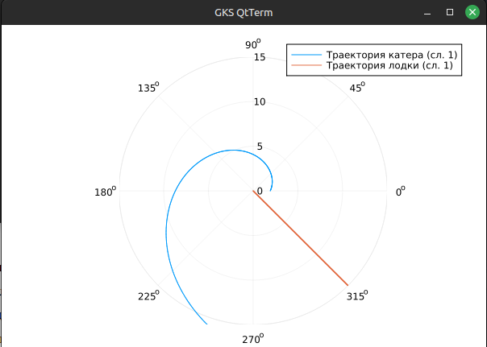
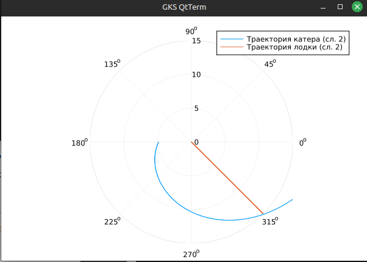
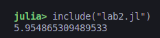
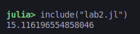

---
## Front matter
title: "Математическое моделирование. Лабораторная Работа №2"
subtitle: "Задача о поиске"
author: "Барсегян Вардан Левонович"

## Generic otions
lang: ru-RU
toc-title: "Содержание"

## Bibliography
bibliography: bib/cite.bib
csl: pandoc/csl/gost-r-7-0-5-2008-numeric.csl

## Pdf output format
toc: true # Table of contents
toc-depth: 2
lof: true # List of figures
lot: true # List of tables
fontsize: 12pt
linestretch: 1.5
papersize: a4
documentclass: scrreprt
## I18n polyglossia
polyglossia-lang:
  name: russian
  options:
	- spelling=modern
	- babelshorthands=true
polyglossia-otherlangs:
  name: english
## I18n babel
babel-lang: russian
babel-otherlangs: english
## Fonts
mainfont: IBM Plex Serif
romanfont: IBM Plex Serif
sansfont: IBM Plex Sans
monofont: IBM Plex Mono
mathfont: STIX Two Math
mainfontoptions: Ligatures=Common,Ligatures=TeX,Scale=0.94
romanfontoptions: Ligatures=Common,Ligatures=TeX,Scale=0.94
sansfontoptions: Ligatures=Common,Ligatures=TeX,Scale=MatchLowercase,Scale=0.94
monofontoptions: Scale=MatchLowercase,Scale=0.94,FakeStretch=0.9
mathfontoptions:
## Biblatex
biblatex: true
biblio-style: "gost-numeric"
biblatexoptions:
  - parentracker=true
  - backend=biber
  - hyperref=auto
  - language=auto
  - autolang=other*
  - citestyle=gost-numeric
## Pandoc-crossref LaTeX customization
figureTitle: "Рис."
tableTitle: "Таблица"
listingTitle: "Листинг"
lofTitle: "Список иллюстраций"
lotTitle: "Список таблиц"
lolTitle: "Листинги"
## Misc options
indent: true
header-includes:
  - \usepackage{indentfirst}
  - \usepackage{float} # keep figures where there are in the text
  - \floatplacement{figure}{H} # keep figures where there are in the text
---

# Цель работы

Построение математической модели для выбора правильной стратегии при решении задач поиска.

# Задание

## Определение варианта

1. Определяю вариант своего задания по формуле (рис. [-@fig:001]).

{#fig:001 width=70%}

## Задание

**Вариант 6**

На море в тумане катер береговой охраны преследует лодку браконьеров.
Через определенный промежуток времени туман рассеивается, и лодка
обнаруживается на расстоянии 6,3 км от катера. Затем лодка снова скрывается в
тумане и уходит прямолинейно в неизвестном направлении. Известно, что скорость
катера в 2,3 раза больше скорости браконьерской лодки.
1. Запишите уравнение, описывающее движение катера, с начальными
условиями для двух случаев (в зависимости от расположения катера
относительно лодки в начальный момент времени).
2. Постройте траекторию движения катера и лодки для двух случаев.
3. Найдите точку пересечения траектории катера и лодки 

# Теоретическое введение

Кривая погони — кривая, представляющая собой решение задачи о «погоне», которая ставится следующим образом. Пусть точка A равномерно движется по некоторой заданной кривой. Требуется найти траекторию равномерного движения точки P такую, что касательная, проведённая к траектории в любой момент движения, проходила бы через соответствующее этому моменту положение точки A.

# Выполнение лабораторной работы

## Вывод уравнения

1. Примем за $t_0 = 0$, $x_0 = 0$ - место нахождения лодки браконьеров в момент обнаружения, $x_k0 = k$ - место нахождения катера береговой охраны относительно лодки браконьеров в момент обнаружения лодки.

2. Введем полярные координаты. Считаем, что полюс - это точка обнаружения лодки браконьеров $x_0$ ($\theta = x_0 = 0$), а полярная ось $r$ проходит через точку нахождения катера береговой охраны.

3. Траектория катера должна быть такой, чтобы и катер, и лодка все время были на одном расстоянии от полюса $\theta$, только в этом случае траектория катера пересечется с траекторией лодки. 
Поэтому для начала катер береговой охраны должен двигаться некоторое
время прямолинейно, пока не окажется на том же расстоянии от полюса, что
и лодка браконьеров. После этого катер береговой охраны должен двигаться
вокруг полюса удаляясь от него с той же скоростью, что и лодка
браконьеров.

4. Чтобы найти расстояние $x$ (расстояние после которого катер начнет
двигаться вокруг полюса), необходимо составить простое уравнение. Пусть через время $t$ катер и лодка окажутся на одном расстоянии $x$ от полюса. За это время лодка пройдет $x$, а катер $k-x$ (или $k+x$, в зависимости от
начального положения катера относительно полюса). Время, за которое они
пройдут это расстояние, вычисляется как $\frac{x}{v}$ или $\frac{k - x}{2.3v}$ ($\frac{k + x}{2.3v}$ во втором случае). Так как время одно и то же, то эти величины одинаковы.
Тогда неизвестное расстояние $x$ можно найти из следующего уравнения:


$$
\frac{x}{v} = \frac{k-x}{2.3v} \text{  -- в первом случае}
$$

$$
\frac{x}{v} = \frac{k+x}{2.3v} \text{  -- во втором}
$$

Отсюда я нашел два значения $x_1 = \frac{6.3}{3.3}$ и $x_2 = \frac{6.3}{1.3}$, задачу будем решать для двух случаев.

5. После того, как катер береговой охраны окажется на одном расстоянии от
полюса, что и лодка, он должен сменить прямолинейную траекторию и начать двигаться вокруг полюса удаляясь от него со скоростью лодки $v$. Для этого скорость катера раскладываем на две составляющие: $v_{r}$ - радиальная скорость и $v_{\tau}$ - тангенциальная скорость. Радиальная скорость - это скорость, с которой катер удаляется от полюса, $v_{r} = \frac{dr}{dt}$. Нам нужно, чтобы эта скорость была равна скорости лодки, поэтому полагаем $\frac{dr}{dt} = v$.

Тангенциальная скорость – это линейная скорость вращения катера относительно полюса. Она равна произведению угловой скорости $\frac{d{\theta}}{dt}$ на радиус $r$, $v_{\tau} = r\frac{d\theta}{dt}$

Получаем $v_{\tau} = \sqrt{(2.3v)^2 - v^2} = \sqrt{4.29v^2} = \sqrt{4.29}v$

Из этой формулы выводим:

$r\frac{d\theta}{dt} = \sqrt{4.29}v$

Решение исходной задачи сводится к решению системы из двух дифференциальных уравнений:

$$\begin{cases}
&\frac{dr}{dt} = v \\
&r\frac{d\theta}{dt} = \sqrt{4.29}v
\end{cases}$$

С начальными условиями для 1 случая:

$$\begin{cases}
&\theta_0 = 0 \\
&r_0 = \frac{6.3}{3.3}
\end{cases}$$

и для 2 случая:

$$\begin{cases}
&\theta_0 = -\pi \\
&r_0 = \frac{6.3}{1.3}
\end{cases}$$

Исключая из полученной системы производную по $t$, можно перейти к следующему уравнению:

$\frac{dr}{d\theta} = \frac{r}{\sqrt{4.29}}$

Начальные условия остаются прежними. Решив это уравнение, мы получим траекторию движения катера в полярных координатах.

## Построение модели

Построим математическую модель на языке программирования Julia.

Импортируем необходимые пакеты и введем известные значения

```Julia
using Plots
using DifferentialEquations

k = 6.3;

fi = 3*pi / 4;

t = 0:0.01:15;
fl(t) = tan(fi) * t;

x1 = k / 3.3;
x2 = k / 1.3;

theta1 = (0, 2*pi);
theta2 = (-pi, pi);
```

Введем функцию, описывающую движение катера береговой охраны

```Julia
f(u, p, t) = u / sqrt(4.29);
```

Решим задачу для первого случая и построим график (рис. [-@fig:002])

```Julia
res1 = ODEProblem(f, x1, theta1);

solution1 = solve(res1, Tsit5(), saveat=0.01);

plot(solution1.t, solution1.u, proj=:polar, lims=(0,15), label="Траектория катера (сл. 1)")

plot!(fill(fi, length(t)), fl.(t), label="Траектория лодки (сл. 1)");
```

{#fig:002 width=70%}

Аналогично решим задачу для второго случая и построим график (рис. [-@fig:003])

```Julia
res2 = ODEProblem(f, x2, theta2);

solution2 = solve(res2, Tsit5(), saveat=0.01);

plot(solution2.t, solution2.u, proj=:polar, lims=(0,15), label="Траектория катера (сл. 2)")

plot!(fill(fi, length(t)), fl.(t), label="Траектория лодки (сл. 2)");
```

{#fig:003 width=70%}

## Нахождение точки пересечения катера и лодки

Для нахождения точки пересечения решим аналитически выведенное дифференциальное уравнение.

Для первого случая получим:

$r = \frac{21{e}^{\frac{10x}{\sqrt{429}}}}{11}$

Найдем точку пересечения (рис. [-@fig:004]):

```Julia
y(x) = (21 * (exp((10*x) / (sqrt(429))))) / (11)

y(fi)
```

{#fig:004 width=70%}

Аналогичные действия дл второго случая. Получим:

$r = \frac{63{e}^{\frac{10x}{\sqrt{429}}}}{13}$

Найдем точку пересечения (рис. [-@fig:005]):

```Julia
y(x) = (63 * (exp((10*x) / (sqrt(429))))) / (13)

y(fi)
```

{#fig:005 width=70%}

# Выводы

Я изучил задачу погони, построил математическую модель для выбора правильной стратегии при решении такой задачи

# Список литературы{.unnumbered}

::: {#refs}
:::
