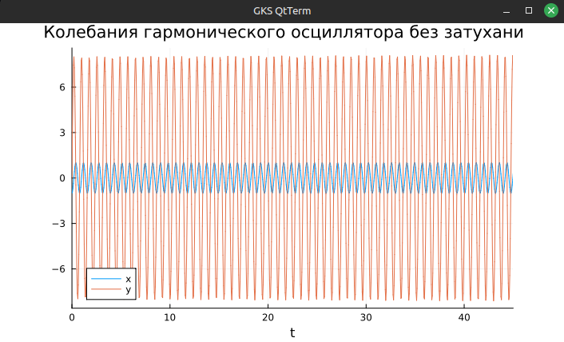
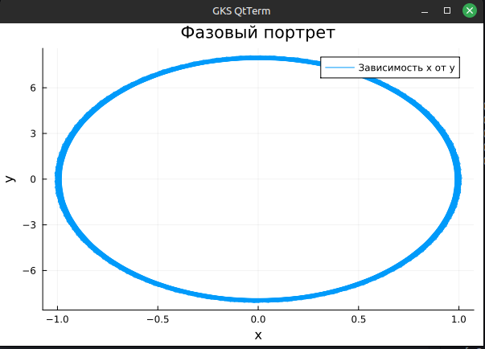
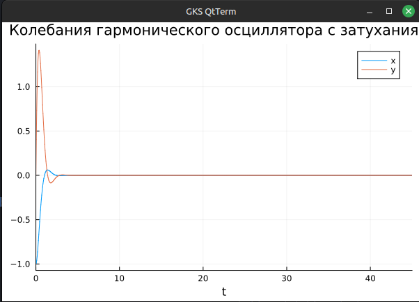
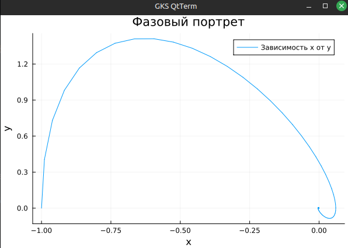
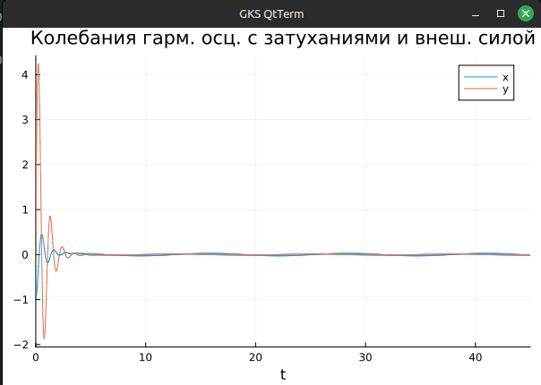
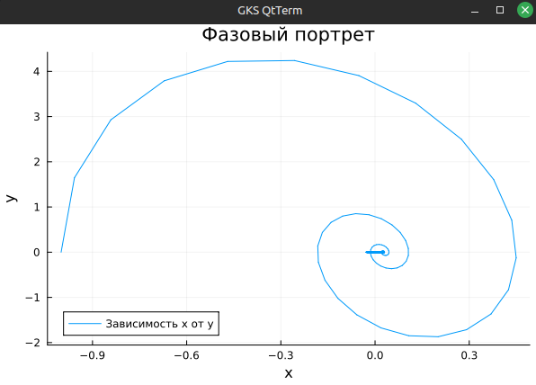

---
## Front matter
title: "Математическое моделирование. Лабораторная Работа №4"
subtitle: "Модель гармонических колебаний"
author: "Барсегян Вардан Левонович"

## Generic otions
lang: ru-RU
toc-title: "Содержание"

## Bibliography
bibliography: bib/cite.bib
csl: pandoc/csl/gost-r-7-0-5-2008-numeric.csl

## Pdf output format
toc: true # Table of contents
toc-depth: 2
lof: true # List of figures
lot: true # List of tables
fontsize: 12pt
linestretch: 1.5
papersize: a4
documentclass: scrreprt
## I18n polyglossia
polyglossia-lang:
  name: russian
  options:
    - spelling=modern
    - babelshorthands=true
polyglossia-otherlangs:
  name: english
## I18n babel
babel-lang: russian
babel-otherlangs: english
## Fonts
mainfont: IBM Plex Serif
romanfont: IBM Plex Serif
sansfont: IBM Plex Sans
monofont: IBM Plex Mono
mathfont: STIX Two Math
mainfontoptions: Ligatures=Common,Ligatures=TeX,Scale=0.94
romanfontoptions: Ligatures=Common,Ligatures=TeX,Scale=0.94
sansfontoptions: Ligatures=Common,Ligatures=TeX,Scale=MatchLowercase,Scale=0.94
monofontoptions: Scale=MatchLowercase,Scale=0.94,FakeStretch=0.9
mathfontoptions:
## Biblatex
biblatex: true
biblio-style: "gost-numeric"
biblatexoptions:
  - parentracker=true
  - backend=biber
  - hyperref=auto
  - language=auto
  - autolang=other*
  - citestyle=gost-numeric
## Pandoc-crossref LaTeX customization
figureTitle: "Рис."
tableTitle: "Таблица"
listingTitle: "Листинг"
lofTitle: "Список иллюстраций"
lotTitle: "Список таблиц"
lolTitle: "Листинги"
## Misc options
indent: true
header-includes:
  - \usepackage{indentfirst}
  - \usepackage{float} # keep figures where there are in the text
  - \floatplacement{figure}{H} # keep figures where there are in the text
---

# Цель работы

Изучение модели гармонического осциллятора, построение математической модели.

# Теоретическое введение

Гармони́ческие колеба́ния — колебания, при которых физическая величина изменяется с течением времени по гармоническому (синусоидальному, косинусоидальному) закону.

Виды колебаний

- **Свободные колебания**. Совершаются под действием внутренних сил системы после того, как система была выведена из положения равновесия. Чтобы свободные колебания были гармоническими, необходимо, чтобы колебательная система была линейной (описывалась линейными уравнениями движения), и в ней отсутствовала диссипация энергии (при ненулевой диссипации, в системе после возбуждения происходят затухающие колебания).
- **Вынужденные колебания**. Совершаются под воздействием внешней периодической силы. Чтобы вынужденные колебания были гармоническими, достаточно, чтобы колебательная система была линейной (описывалась линейными уравнениями движения), а внешняя сила (воздействие) менялась со временем как гармоническое колебание (то есть, чтобы зависимость от времени этой силы тоже, в свою очередь, была синусоидальной).

Очень часто малые колебания, как свободные, так и вынужденные, которые происходят в реальных системах, можно считать имеющими форму гармонических колебаний или очень близкую к ней.


Как установил в 1822 году Фурье, широкий класс периодических функций может быть разложен на сумму тригонометрических компонентов — в ряд Фурье. Другими словами, любое периодическое колебание может быть представлено как сумма гармонических колебаний с соответствующими амплитудами, частотами и начальными фазами. Среди слагаемых этой суммы существует гармоническое колебание с наименьшей частотой, которая называется основной частотой, а само это колебание — первой гармоникой или основным тоном, частоты же всех остальных слагаемых, гармонических колебаний, кратны основной частоте, и эти колебания называются высшими гармониками или обертонами — первым, вторым и т.д.


Для широкого класса систем откликом на гармоническое воздействие является гармоническое колебание (свойство линейности), при этом связь воздействия и отклика является устойчивой характеристикой системы. С учётом предыдущего свойства это позволяет исследовать прохождение колебаний произвольной формы через системы.

# Задание

## Определение вариант задания

Определим вариант задания в соответствии с формулой (рис. [-@fig:001]).

{#fig:001 width=70%}

## Задание

Вариант № 6

Постройте фазовый портрет гармонического осциллятора и решение уравнения
гармонического осциллятора для следующих случаев

1. Колебания гармонического осциллятора без затуханий и без действий внешней
силы

$$ \ddot{x} + 8x = 0 $$

2. Колебания гармонического осциллятора c затуханием и без действий внешней
силы

$$ \ddot{x} + \dot{x} + 3x = 0 $$

3. Колебания гармонического осциллятора c затуханием и под действием внешней
силы

$$ \ddot{x} + 3\dot{x} + 6x = sin(0.5t) $$

На интервале $t \in [0; 45]$ (шаг 0.05) с начальными условиями $x_0 = -1, y_0 = 0$

# Выполнение лабораторной работы

## Модель колебаний гармонического осциллятора без затуханий и без действий внешней силы

Реализуем модель на Julia

```Julia
using DifferentialEquations, Plots;

t = (0, 45)

u0 = [-1, 0]

p1 = [0, 8]

function f(u, p, t)
	x0, y0 = u
	g, w = p
	dx = y0
	dy = -g .*y0 -w^2 .*x0
	return [dx, dy]
end

problem1 = ODEProblem(f, u0, t, p1)
solution1 = solve(problem1, saveat=0.05)
```

Построим графики решения уравнения гармонического осциллятора (рис. [-@fig:002]). и график фазового портрета (рис. [-@fig:003]).

```Julia
plot(solution1, title="Колебания гармонического осциллятора без затуханий", label=["x" "y"], xaxis="t")

plot(solution1, idxs=(1, 2), title="Фазовый портрет", label="Зависимость x от y", xaxis="x", yaxis="y")
```

{#fig:002 width=70%}

{#fig:003 width=70%}

Из графика видно отсутствие затуханий и периодичность колебаний

## Модель колебаний гармонического осциллятора c затуханиями и без действий внешней силы

Реализуем модель на Julia

```Julia
using DifferentialEquations, Plots;

t = (0, 45)

u0 = [-1, 0]

p2 = [4, 3]

function f(u, p, t)
	x0, y0 = u
	g, w = p
	dx = y0
	dy = -g .*y0 -w^2 .*x0
	return [dx, dy]
end

problem2 = ODEProblem(f, u0, t, p2)
solution2 = solve(problem2, saveat=0.05)
```

Построим графики решения уравнения гармонического осциллятора (рис. [-@fig:004]). и график фазового портрета (рис. [-@fig:005]).

```Julia
plot(solution2, title="Колебания гармонического осциллятора с затуханиями", label=["x" "y"], xaxis="t")

plot(solution2, idxs=(1, 2), title="Фазовый портрет", label="Зависимость x от y", xaxis="x", yaxis="y")
```

{#fig:004 width=70%}

{#fig:005 width=70%}

На графике фазового портрета видно, что график затухает.

## Модель колебаний гармонического осциллятора c затуханиями и с действием внешней силы

Реализуем модель на Julia, добавив функцию воздействие внешней силы.

```Julia
using DifferentialEquations, Plots;

t = (0, 45)

u0 = [-1, 0]

p3 = [3, 6]

f(t) = sin(0.5*t)

function f2(u, p, t)
	x0, y0 = u
	g, w = p
	dx = y0
	dy = -g .*y0 -w^2 .*x0 .+f(t)
	return [dx, dy]
end

problem3 = ODEProblem(f2, u0, t, p3)
solution3 = solve(problem3, Tsit5(), saveat=0.05)
```

Построим графики решения уравнения гармонического осциллятора (рис. [-@fig:006]). и график фазового портрета (рис. [-@fig:007]).

```Julia
plot(solution3, title="Колебания гарм. осц. с затуханиями и внеш. силой", label=["x" "y"], xaxis="t")

plot(solution3, idxs=(1, 2), title="Фазовый портрет", label="Зависимость x от y", xaxis="x", yaxis="y")
```

{#fig:006 width=70%}

{#fig:007 width=70%}

# Выводы

Я изучил модель гармонического осциллятора, построил математическую модель с определенными начальными параметрами, построил графики уравнения гармонического осциллятора и фазовый портрет.

# Список литературы{.unnumbered}

::: {#refs}
:::
