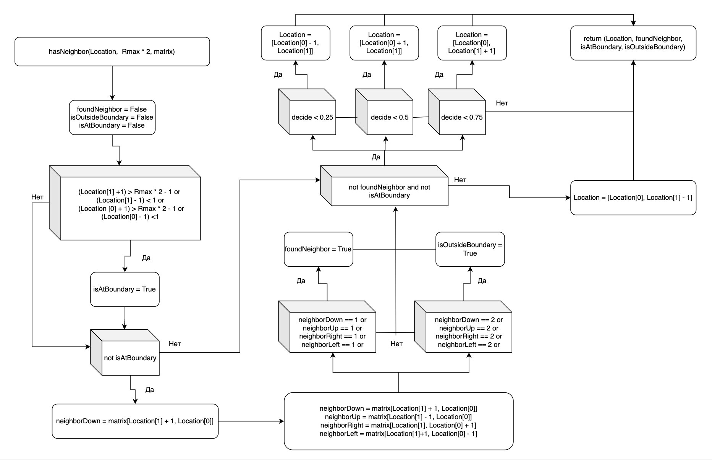

---
## Front matter
lang: ru-RU
title: Групповой проект "Неравновесная агрегация, фракталы
subtitle: Алгоритмы решения задачи
author:
  - Ищенко И. О.,
  - Мишина А. А.,
  - Дикач А. О.,
  - Барсегян В. Л.,
  - Галацан Н. И.,
  - Дудырев Г. А.
institute:
  - Российский университет дружбы народов, Москва, Россия
date: 11 апреля 2025

## i18n babel
babel-lang: russian
babel-otherlangs: english

## Formatting pdf
toc: false
toc-title: Содержание
slide_level: 2
aspectratio: 169
section-titles: true
theme: metropolis
header-includes:
 - \metroset{progressbar=frametitle,sectionpage=progressbar,numbering=fraction}
---

## Состав исследовательской команды

Студенты группы НПИбд-02-22:

- Ищенко Ирина Олеговна
- Мишина Анастасия Алексеевна

И студенты группы НПИбд-01-22:

- Дикач Анна Олеговна
- Барсегян Вардан Левонович
- Галацан Николай Ильич
- Дудырев Глеб Андрееевич

# Вводная часть

**Цель работы**

Изучить алгоритм моделирования агрегации, ограниченной диффузией (DLA) на сетке.

**Задачи**

- Рассмотреть алгоритм моделирования DLA  
- Реализовать модель DLA на двумерной решётке  

## Алгоритм DLA

{#fig:001 width=40%}

## Реализация алгоритма DLA 

{#fig:002 width=40%}

## Алгоритм выпускания частицы

{#fig:003 width=60%}

## Случайное блуждание

Каждая частица движется случайным образом по двумерной решётке, совершая шаги в одном из четырёх направлений с равной вероятностью: вверх, вниз, влево или вправо.

$$
v^{\uparrow} = (0, 1), \quad v^{\downarrow} = (0, -1), \quad v^{\rightarrow} = (1, 0), \quad v^{\leftarrow} = (-1, 0)
$$

## Случайное блуждание

Положение частицы после $n$ шагов описывается суммой случайных векторов:

$$
S_n = \sum_{i=1}^{n} v_i^{(*)}
$$

где каждый $v_i$ выбирается независимо и равновероятно из множества направлений:

$$
P\left(v_i = v^{(*)}\right) = \frac{1}{4}, \quad (*) \in \{\uparrow, \downarrow, \rightarrow, \leftarrow\}
$$

## Описание алгоритма движения частицы

{#fig:004 width=65%}

## Заключение

В ходе выполнения второго этапа проекта мы подробно рассмотрели алгоритм DLA и предложили способ его реализации. Были разработаны блок-схемы, отражающие ключевые этапы работы алгоритма.
